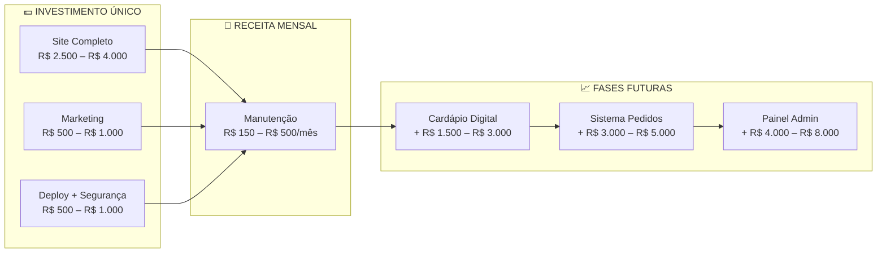

# 💰 Precificação — Projeto Galeteria "Galetos e Espetos"

> **Data da análise:** 23/02/2026  
> **Base:** Mercado freelancer brasileiro 2025-2026  
> **Cliente:** Galeteria "Recanto da Sustenta"  
> **Perfil:** Microempreendedor local, primeiro projeto digital

---

## 📌 O Que Foi Entregue (Escopo Atual)

Antes de precificar, vamos listar objetivamente **tudo que já foi feito** e **tudo que será feito na migração**:

| Entrega | Conteúdo |
|---|---|
| **Landing page completa** | HTML/CSS/JS customizado, design premium, responsivo mobile-first |
| **Design exclusivo** | Sistema de cores, tipografia (Google Fonts), dark/light theme |
| **Conteúdo visual** | Imagens geradas por IA para os pratos (4 produtos) |
| **Cardápio digital** | Seção de cardápio com cards, preços, badges |
| **Integração Google Maps** | Iframe com localização exata do negócio |
| **Botão WhatsApp** | FAB flutuante com ícone SVG oficial |
| **Links sociais** | Instagram, TikTok, Kwai com ícones SVG |
| **Animações** | Reveal scroll, hover effects, teaser pulse, toast notifications |
| **SEO básico** | Meta tags, description, keywords, title, lang pt-BR |
| **Performance** | Lazy loading de imagens, IIFE no JS, passive scroll listeners |
| **Favicon** | Emoji SVG inline (sem arquivo extra) |
| **Acessibilidade** | Aria-labels, alt texts, contraste adequado |
| **Plano de marketing** | Documento completo com estratégia digital e offline |

**Na migração (serviço adicional):**

| Entrega | Conteúdo |
|---|---|
| **Deploy profissional** | GitHub Pages com GitHub Actions (CI/CD automático) |
| **Domínio customizado** | Configuração DNS, CNAME, HTTPS automático |
| **Segurança** | CSP, headers de segurança, API key restrita, SPF/DMARC, Domain Lock |
| **Documentação técnica** | Arquivo de migração completo com passo a passo |
| **Infraestrutura Git** | Repositório profissional, .gitignore, branch protection |
| **Proteção de marca** | Configuração dos 4 domínios (redirect, lock, renovação) |

---

## 📊 Pesquisa de Mercado — Quanto o Mercado Cobra

### Landing Page (Freelancer Brasil, 2025-2026)

| Nível do Profissional | Faixa de Preço | Hora Estimada |
|---|---|---|
| **Júnior** (templates, plataformas) | R$ 500 – R$ 2.500 | R$ 40 – R$ 60/h |
| **Pleno** (custom, responsivo) | R$ 2.000 – R$ 5.000 | R$ 70 – R$ 100/h |
| **Sênior** (design exclusivo, animações) | R$ 5.000 – R$ 10.000 | R$ 110 – R$ 200/h |
| **Agência** | R$ 3.000 – R$ 25.000 | R$ 150 – R$ 400/h |

> **Fonte:** Levantamento de mercado (zammes.com.br, deskito.com.br, metodoviral.com, simpplim.com — fev/2026)

### Site Institucional Completo (5-10 páginas)

| Nível | Faixa de Preço |
|---|---|
| **Júnior** | R$ 3.000 – R$ 5.000 |
| **Pleno** | R$ 5.000 – R$ 10.000 |
| **Sênior** | R$ 10.000 – R$ 18.000 |

### Manutenção Mensal

| Tipo de Manutenção | Faixa Mensal |
|---|---|
| Básica (checagem mensal, uptime) | R$ 100 – R$ 300 |
| Intermediária (atualizações, backups) | R$ 300 – R$ 800 |
| Completa (segurança, monitoramento, conteúdo) | R$ 800 – R$ 1.500 |

### Custos Fixos Anuais (para referência)

| Item | Custo Anual |
|---|---|
| Domínio `.com.br` (Registro.br) | R$ 40,00 |
| Domínio `.com` | ~R$ 60,00 |
| Domínio `.store` / `.online` | ~R$ 30 – R$ 80 cada |
| Hospedagem GitHub Pages | **R$ 0 (grátis)** |
| Certificado HTTPS (Let's Encrypt) | **R$ 0 (grátis)** |

---

## 🎯 Precificação Recomendada — Projeto Galeteria

### Onde este projeto se encaixa no mercado?

Este projeto **não é um site de template**. Ele possui:
- ✅ Design 100% customizado (não usou WordPress, Wix, ou template)
- ✅ Código feito do zero (HTML/CSS/JS vanilla)
- ✅ Animações e microinterações elaboradas
- ✅ Two themes (dark/light) com design system
- ✅ Imagens profissionais geradas por IA
- ✅ Deploy automatizado com CI/CD
- ✅ Configuração de segurança profissional

Isso posiciona o projeto na faixa **Pleno/Sênior**, que seria a cobrança justa pelo valor entregue.

---

### 💵 Modelo 1 — Cobrança por Projeto (Preço Fechado)

> [!TIP]
> **Recomendado para este caso.** O cliente já sabe exatamente o que está recebendo e não se preocupa com horas — ele vê o produto final.

| Serviço | Valor Sugerido | Justificativa |
|---|---|---|
| **Landing page completa** (design, código, imagens, animações, temas) | R$ 2.500 – R$ 4.000 | Design exclusivo, responsivo, sem template |
| **Plano de marketing digital** | R$ 500 – R$ 1.000 | Documento completo com estratégias |
| **Deploy + Configuração** (domínio, DNS, HTTPS, GitHub Pages) | R$ 500 – R$ 800 | Configuração técnica do go-live |
| **Segurança** (CSP, SPF/DMARC, Domain Lock, API keys) | R$ 300 – R$ 500 | Hardening profissional |
| **Gestão dos 4 domínios** (configuração, redirect, renovação) | R$ 200 – R$ 400 | Setup inicial dos domínios |

| **TOTAL DO PROJETO** | **Faixa Sugerida** |
|---|---|
| Valor mínimo justo | **R$ 3.500** |
| Valor médio recomendado | **R$ 4.500** |
| Valor premium (se o cliente valoriza) | **R$ 6.000** |

---

### 💵 Modelo 2 — Pacote Único Simplificado (para o cliente)

Quando for apresentar ao cliente, **simplifique**. O cliente não quer ver "CSP" ou "DMARC" — ele quer saber o que está comprando em linguagem simples:

```
╔══════════════════════════════════════════════════════╗
║        GALETOS E ESPETOS — PROPOSTA COMERCIAL        ║
╠══════════════════════════════════════════════════════╣
║                                                      ║
║  🌐 SITE PROFISSIONAL COMPLETO                      ║
║  ─────────────────────────────────────               ║
║  ✓ Página bonita e moderna do seu negócio            ║
║  ✓ Funciona perfeitamente no celular                 ║
║  ✓ Fotos profissionais dos seus pratos               ║
║  ✓ Cardápio com preços                               ║
║  ✓ Botão do WhatsApp para pedidos                    ║
║  ✓ Mapa com a localização                            ║
║  ✓ Links das redes sociais                           ║
║  ✓ Endereço próprio do site (galetoseespetos.com.br) ║
║  ✓ Cadeado de segurança (HTTPS)                      ║
║  ✓ Proteção contra golpes e hackers                  ║
║                                                      ║
║  💰 Investimento: R$ 4.500,00                        ║
║  📅 Parcelamento: até 3x de R$ 1.500                 ║
║                                                      ║
║  🔁 Manutenção mensal (opcional): R$ 250/mês         ║
║                                                      ║
╚══════════════════════════════════════════════════════╝
```

> [!IMPORTANT]
> **Nunca apresente a planilha técnica detalhada ao cliente.** Ele não precisa saber que você configurou SPF/DMARC — ele precisa saber que "o site dele está protegido contra golpes". Traduza tecnologia em benefício.

---

### 💵 Modelo 3 — Cobrança por Hora

Se preferir cobrar por hora, calcule assim:

| Etapa | Horas Estimadas | Valor/Hora | Subtotal |
|---|---|---|---|
| Planejamento e briefing | 2h | R$ 80 | R$ 160 |
| Design (layout, cores, tipografia) | 4h | R$ 80 | R$ 320 |
| Desenvolvimento HTML/CSS | 8h | R$ 80 | R$ 640 |
| JavaScript (interações, tema, menu) | 4h | R$ 80 | R$ 320 |
| Geração de imagens IA | 2h | R$ 80 | R$ 160 |
| Testes e ajustes responsivo | 3h | R$ 80 | R$ 240 |
| Deploy + configuração domínio + DNS | 3h | R$ 80 | R$ 240 |
| Segurança (CSP, SPF, domain lock) | 2h | R$ 80 | R$ 160 |
| Plano de marketing | 3h | R$ 80 | R$ 240 |
| Revisões com cliente | 3h | R$ 80 | R$ 240 |
| **TOTAL** | **34h** | **R$ 80/h** | **R$ 2.720** |

> [!NOTE]
> A R$ 80/hora, o total dá R$ 2.720, que é o **piso**. Porém, cobrar por hora subestima o valor do skill — o cliente paga pela sua expertise, não pelo tempo. Um sênior faria o mesmo em menos horas, mas não cobraria menos. **Prefira preço fechado.**

---

## 📋 Manutenção Mensal — Receita Recorrente

A manutenção é onde está a **renda passiva** e a relação de longo prazo com o cliente.

### Planos de Manutenção Sugeridos

| Plano | O que inclui | Valor Mensal |
|---|---|---|
| **🥉 Básico** | Monitoramento de uptime, renovação de domínios, suporte por WhatsApp (até 2 chamados/mês) | **R$ 150/mês** |
| **🥈 Intermediário** | Tudo do Básico + atualização de conteúdo (cardápio, preços, fotos) + relatório mensal | **R$ 300/mês** |
| **🥇 Premium** | Tudo do Intermediário + novas funcionalidades (1 melhoria/mês) + SEO básico + analytics | **R$ 500/mês** |

> [!TIP]
> **Recomendo começar com o plano Intermediário (R$ 300/mês)** para a Galeteria. O cardápio e os preços mudam com frequência — isso justifica a manutenção. A dona não vai saber editar HTML, então ela precisa de você.

### Cálculo da Receita Anual com Manutenção

| Cenário | Valor Mensal | Receita Anual |
|---|---|---|
| 1 cliente (Básico) | R$ 150 | R$ 1.800 |
| 1 cliente (Intermediário) | R$ 300 | R$ 3.600 |
| 5 clientes (Intermediário) | R$ 1.500 | R$ 18.000 |
| 10 clientes (mix) | ~R$ 3.000 | ~R$ 36.000 |

> 10 clientes com manutenção = renda mensal de R$ 3.000 praticamente passiva (poucas horas por mês de trabalho real).

---

## 🧮 Cálculo do Custo Real — O Que a Cliente Gasta Sem Você

Para justificar o preço, mostre à cliente quanto ela **gastaria** fazendo de outra forma:

| Alternativa | Custo Inicial | Custo Mensal | 1º Ano Total |
|---|---|---|---|
| **Você (freelancer)** | R$ 4.500 | R$ 300 (manutenção) | **R$ 8.100** |
| **Agência pequena** | R$ 8.000 – R$ 15.000 | R$ 500 – R$ 1.000 | **R$ 14.000 – R$ 27.000** |
| **Plataforma (Wix/Squarespace)** | R$ 0 | R$ 50 – R$ 150/mês + domínio | **R$ 600 – R$ 1.800** (mas sem design exclusivo) |
| **Sobrinho que "mexe com computador"** | R$ 200 – R$ 500 | R$ 0 | **R$ 500** (mas resultado amador e sem suporte) |

> [!IMPORTANT]
> O diferencial do seu serviço: **design profissional, hospedagem gratuita (GitHub Pages), segurança real, e suporte contínuo**. A plataforma Wix pode ser mais barata inicialmente, mas cobra mensalidade para sempre e limita personalizações. Seu modelo tem custo de hospedagem **zero** — uma vantagem competitiva enorme.

---

## 💎 Valor Agregado — O Que o Dinheiro Não Compra Fácil

Ao precificar, considere que você não está vendendo "um site". Está vendendo:

| O que o cliente acha que compra | O que ele realmente recebe |
|---|---|
| "Um site" | Presença digital profissional que gera confiança |
| "Uma página bonita" | Design premium que diferencia da concorrência |
| "WhatsApp no site" | Canal de vendas direto com conversão |
| "O mapa" | Clientes encontrando o negócio pelo Google |
| "Proteção" | Marca blindada contra fraudes e clones |
| "Manutenção" | Parceiro técnico disponível para o negócio crescer |

---

## 🤝 Estratégia de Negociação

### Se a cliente disser que está caro:

1. **Não baixe o preço — ajuste o escopo:**
   - Retire o plano de marketing (economiza R$ 500-1.000)
   - Ofereça manutenção trimestral em vez de mensal
   - Divida o pagamento em mais parcelas

2. **Mostre o ROI (Retorno sobre Investimento):**
   - "Se o site trouxer **2 clientes novos por mês** que gastam R$ 80 cada, em 3 meses o investimento já se pagou"
   - "Uma placa de rua custa R$ 300/mês e atinge 100 pessoas. O site atinge milhares, 24h por dia, e custa R$ 0/mês de hospedagem"

3. **Ofereça garantia:**
   - "Se em 30 dias você não estiver satisfeita, eu ajusto tudo que precisar sem custo extra"

### Se a cliente quiser "só o básico":

| Pacote | Inclui | Preço |
|---|---|---|
| **Essencial** | Landing page + deploy + 1 domínio | R$ 2.500 |
| **Profissional** | Essencial + segurança + marketing + 4 domínios | R$ 4.500 |
| **Premium** | Profissional + 6 meses de manutenção inclusa | R$ 6.000 |

---

## 📊 Quadro Resumo Final



---

## 🔮 Precificação das Fases Futuras

Quando a dona pedir para avançar nas fases:

| Fase | Descrição | Preço Estimado |
|---|---|---|
| **Fase 2** — Cardápio Digital | Cardápio interativo com filtros, dados em JSON | R$ 1.500 – R$ 3.000 |
| **Fase 3** — Sistema de Pedidos | Carrinho + gerador de mensagem WhatsApp | R$ 3.000 – R$ 5.000 |
| **Fase 4** — Painel Admin | Dashboard de gestão, CRUD de cardápio | R$ 4.000 – R$ 8.000 |
| **Total do ecossistema completo** | Todas as 4 fases | **R$ 11.000 – R$ 20.000** |

> [!TIP]
> Não apresente as fases futuras agora. Deixe a primeira entrega impressionar e, naturalmente, a cliente pedirá mais. Preços futuros podem ser revisados conforme a relação de confiança cresce.

---

## ⚖️ Importante: Fatores que Justificam Cobrar Mais

| Fator | Impacto no Preço |
|---|---|
| **Hospedagem grátis** (GitHub Pages) | A cliente economiza R$ 300-600/ano que pagaria em hospedagem convencional |
| **HTTPS grátis** (Let's Encrypt) | Certificado SSL comercial custa R$ 100-500/ano |
| **4 domínios configurados** | Cada domínio requer configuração DNS separada |
| **Segurança profissional** | CSP, SPF, DMARC — serviço que agências cobram separado |
| **Código próprio** (sem WordPress) | Não depende de plugins, não tem mensalidade de tema |
| **Zero dependência de plataforma** | O site nunca vai "parar de funcionar" por falta de pagamento à plataforma |

---

> *O preço é o que você paga. O valor é o que você recebe.* — Warren Buffett 💎
